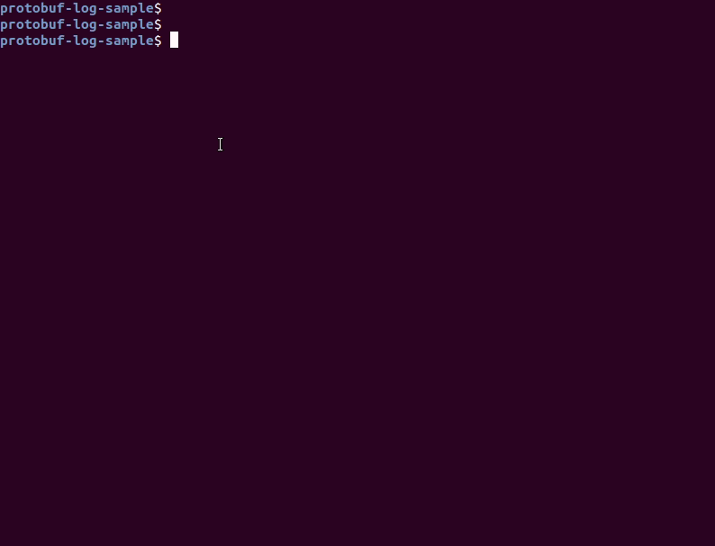

# protobuf-log-sample

This repo contains a sample log defintion ([`log.proto`](https://github.com/iamAzeem/protobuf-log-sample/blob/master/log.proto)) in [Protocol Buffers](https://developers.google.com/protocol-buffers/) format and the read/write scripts in Ruby and Python.

It's just a simple test of reading/writing protobuf messages with different language bindings.

## Log Definition (`log.proto`)
```
syntax = "proto3";

package service.logging;

import "google/protobuf/timestamp.proto";

message Log {
    message Context {
        google.protobuf.Timestamp timestamp = 1;
        string host_or_ip = 2;
        string service_name = 3;
        string user = 4;
    }

    enum Level {
        DEBUG = 0;
        INFO = 1;
        WARN = 2;
        ERROR = 3;
        FATAL = 4;
    }

    Context context = 1;
    Level level = 2;
    string message = 3;
}
```

## Scripts
- Ruby ([`log.rb`](https://github.com/iamAzeem/protobuf-log-sample/blob/master/log.rb))
- Python ([`log.py`](https://github.com/iamAzeem/protobuf-log-sample/blob/master/log.py))

### Prerequisites

- Protocol Buffers Compiler (`protoc`)
- Ruby + [google-protobuf](https://github.com/ruby-protobuf/protobuf/wiki/Installation) gem
- Python

The generated files for Ruby and Python ([`log_pb.rb`](https://github.com/iamAzeem/protobuf-log-sample/blob/master/log_pb.rb) and [`log_pb2.py`](https://github.com/iamAzeem/protobuf-log-sample/blob/master/log_pb2.py)) are also included here.

However, they can be regenerated with `protoc` like this:
```
$ protoc --ruby_out=. --python_out=. ./log.proto
```

### How to run scripts?

Both scripts offer the same functionality via command line options i.e.:

- `[-w]` write log file
- `[-r]` read log file and print
- `[-j]` read log file and print in JSON format

#### General Command Line Format

```
script [-w | -r | -j] filename
```

Use `-h` or `--help` for help i.e. `script -h`.

#### Example (assuming both scripts have execution permission [`chmod +x script`])

Write sample log file with Ruby script:
```
$ ./log.rb -w log.bin
Writing protobuf sample log file [log.bin]... [DONE]
```

Read and print with Python script:
```
$ ./log.py -r log.bin
Dumping protobuf binary file [log.bin]...
context {
  timestamp {
    seconds: 1591027107
  }
  host_or_ip: "192.168.xxx.xxx"
  service_name: "test"
  user: "test"
}
level: INFO
message: "This is a test log generated by [./log.rb]."

[DONE]
```

Read and print with Python script (JSON):
```
$ ./log.py -j log.bin
Dumping protobuf binary file as JSON [log.bin]...
{
  "message": "This is a test log generated by [./log.rb].", 
  "context": {
    "timestamp": "2020-06-01T15:58:27Z", 
    "hostOrIp": "192.168.xxx.xxx", 
    "serviceName": "test", 
    "user": "test"
  }, 
  "level": "INFO"
}
[DONE]
```

### Demo


